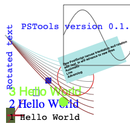
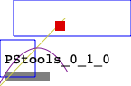

# pstools_r
Rust version of pstools -- very lightweight PostScript file writing interface

The crate can be used as a callable library; it can also build a stand-alone tool that
parses inputs with simple commands.


# Example - Calling from Rust

```rust
let mut pst = PSTool::new();
// pst.add_box(5.0, 5.0, 20.0, 30.0);
// pst.set_color(0.3, 0.4, 0.2, 1.0);
// pst.add_text(20.0, 10.0, "Hello world".to_string());
pst.demo(); // Demonstrates the various features
pst.generate("demo.ps".to_string());
```

Generates something like this:



The "demo" method for the PSTool struct walks through a variety of features,
and is intended to be a quick-reference for how things work.


# Text File Interface

The stand-alone version parses simple text files, line by
line.  The following text produces a PS file as shown.

```
# A sample input file for the PSTool command line tool
# Blank lines and lines with # at start are ignored
comment Need_to_upgrade_the_parser_to_handle_spaces

color .5 .5 .5
fill 1
box 10 10 60 20
color 0 0 1
fill 0
box 5 15 44 56

box 20 60 150 100
color .8 .8 .2
line 5 5 77 80

color 1 0 0
fill 1

box 66 66 77 77

color .6 .1 .6
curve 2 2 40 90 80 20

color 0 0 0
text 10 30 PStools_0_1_0
```




Text file commands are as follows:

* color r g b
* colora r g b
* fill
* nofill
* box llx lly urx ury
* line llx lly urx ury
* circle x y radius
* font fontname pointsize
* text x y Comments
* pscomment Comments